# MCM Monitoring use case - Notification messages are not received

This document explains about how SRE is going to analyze and resolve an Incident using MCM monitoring.

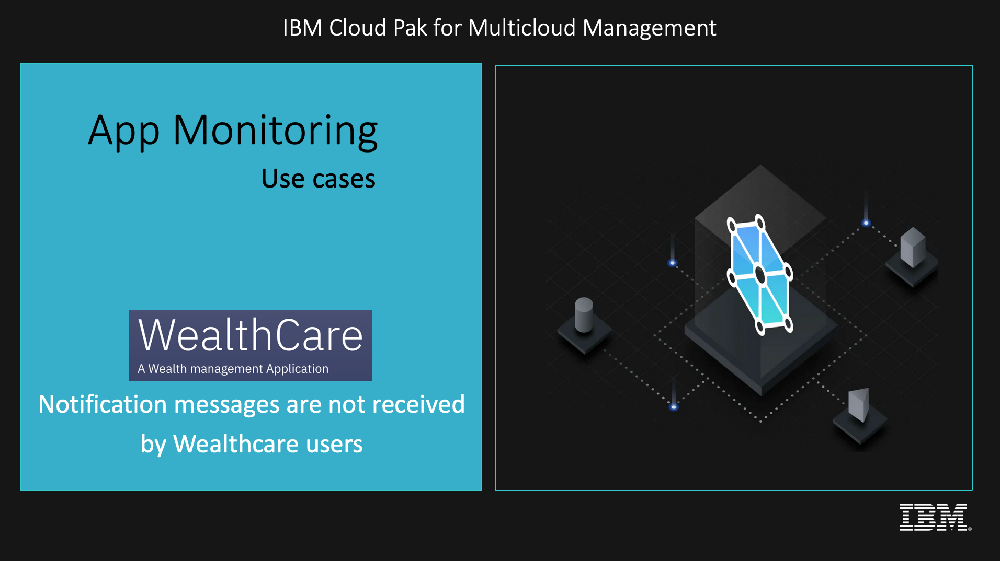

## Use case

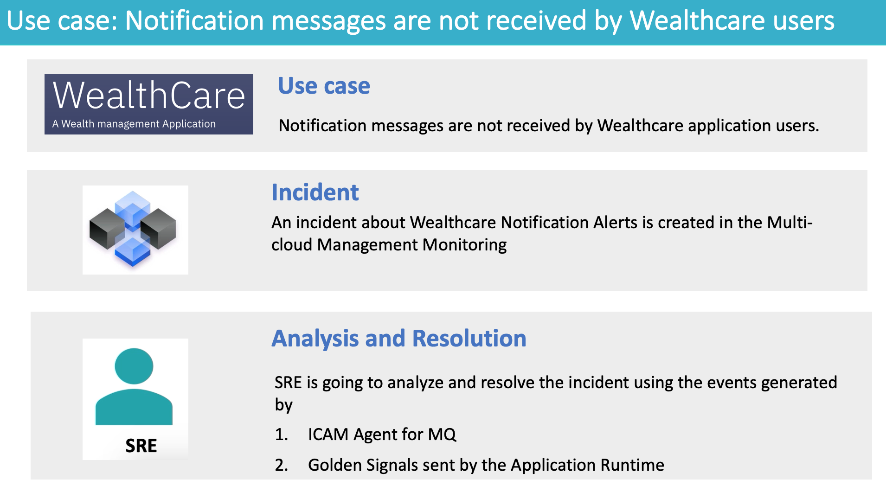

The Wealthcare application `users are not receiving Notification messages` for the operation that they are doing at Wealthcare.

An incident about `Wealthcare Notification Alerts` is created in the Multi-cloud Management Monitoring.

Now SRE is going to analyze and resolve the incident using the events generated by 
- ICAM Agent for MQ
- Golden Signals sent by the Application Runtime

## Note

This use case is going to leverages the following objects for Application Monitoring and Incident management.
- Thresholds
- Runbooks
- Event Policies
- Incident Policies

How to create and configure them are discussed in another git repo. 

https://github.com/GandhiCloudLab/mcm-monitoring-usecase-notification-configuration

------

## Abstract of the Incident and resolution steps

Here is the abstract of the Incident and resolution steps.

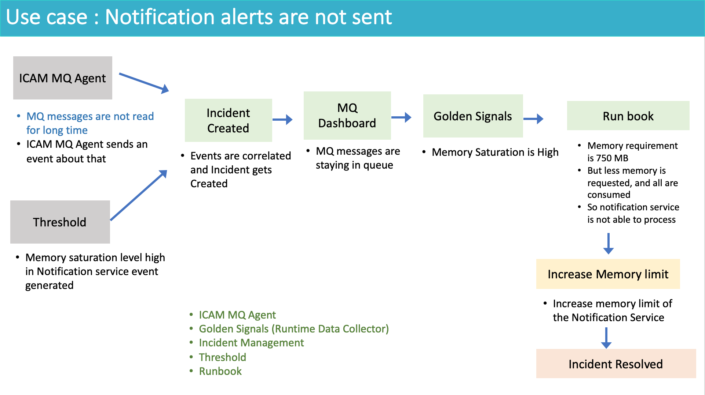

ICAM Agent of MQ creates an event.

Threshold config will also create an event.

Both the events are correlated and incident get created.

SRE look at the events in the incident.

He opens the Resource Dashboard of MQ and he observe that there some messages left in queue for long time.

Then he opens the Golden signals page of the Notification service.

He identify the problem is because of memory saturation in notification service 

He opens the runbook associated with the event and get to know that it requires 750 MB memory. He increases the memory limit.

The incident is resolved.

------

## Incident list

As a SRE, I  login into MCM Monitoring console, and look at my group, for incidents. 

There is an incident about Wealthcare Notification Alerts

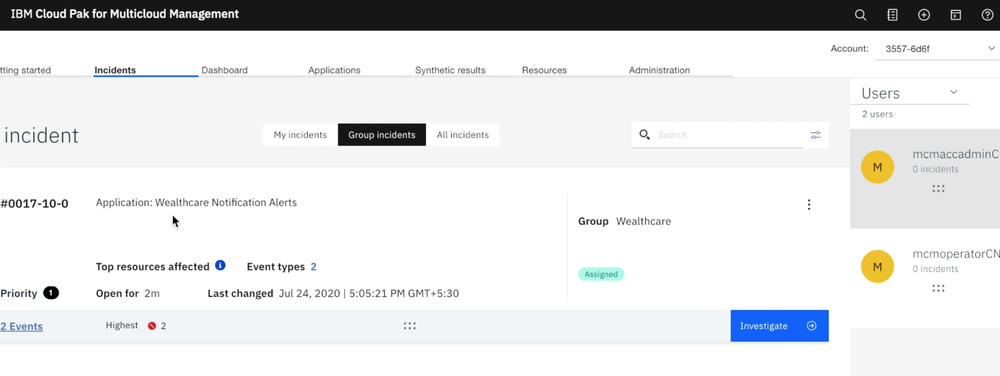

Two events are associated with this incident.

It is in Assigned state.

It is assigned to wealthcare group.

Lets click on Investigate to do the analysis.

It opens up the incident details page.

## Incident Detail

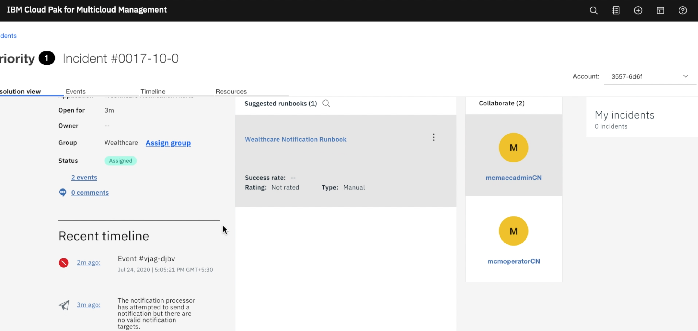

Click on events tab. It shows the events detail page. Two events are listed here.

It shows the event details of `wealthcare Message Queue is not being read`.

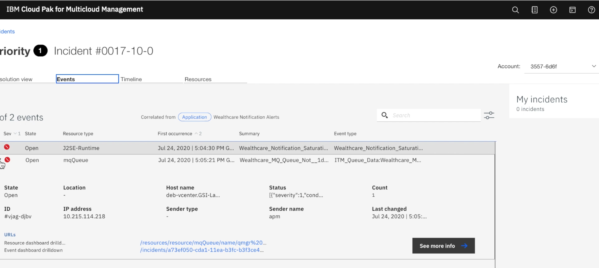

Lets goto the resource dashboard screen for MQ to understand the event in detail.

------

## MQ Dashboard

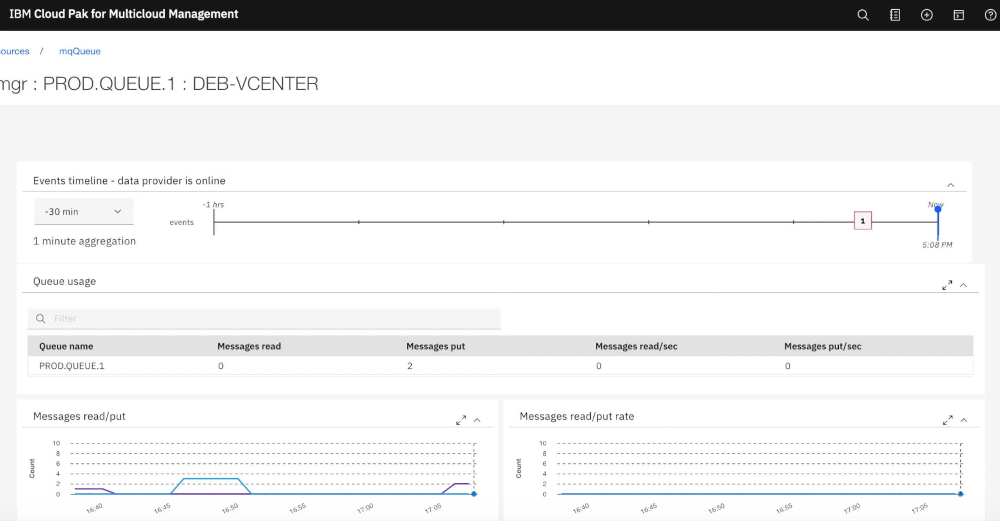
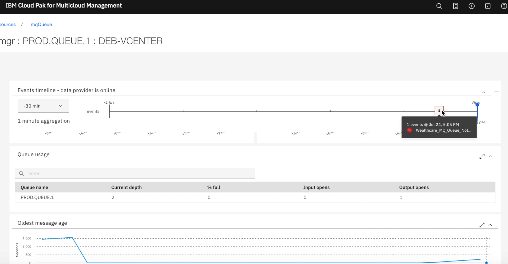

So this event occurred at 5 PM

You can see that there are 2 messages available in the `PROD.QUEUE.1` which is not read for some period of time.

We need to identify the reason why it is not read. 

Lets go back to incidents details to anaylse about another event associated with this incident.

------

## Notification service saturation

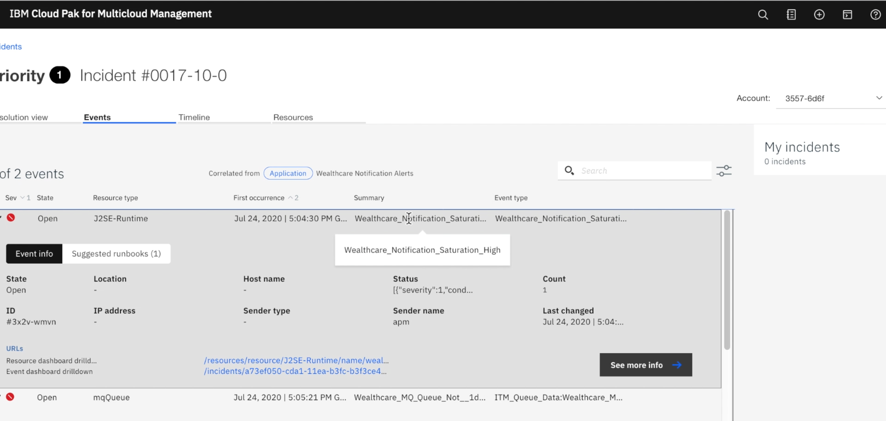

The event is about Notification Saturation is high.

Lets goto the resource dashboard screen to understand the event in detail.

It opens up the golden signal page of the notification service.
It shows the event details of `wealthcare Message Queue is not being read`.

------

## Golden Signal of Notification service

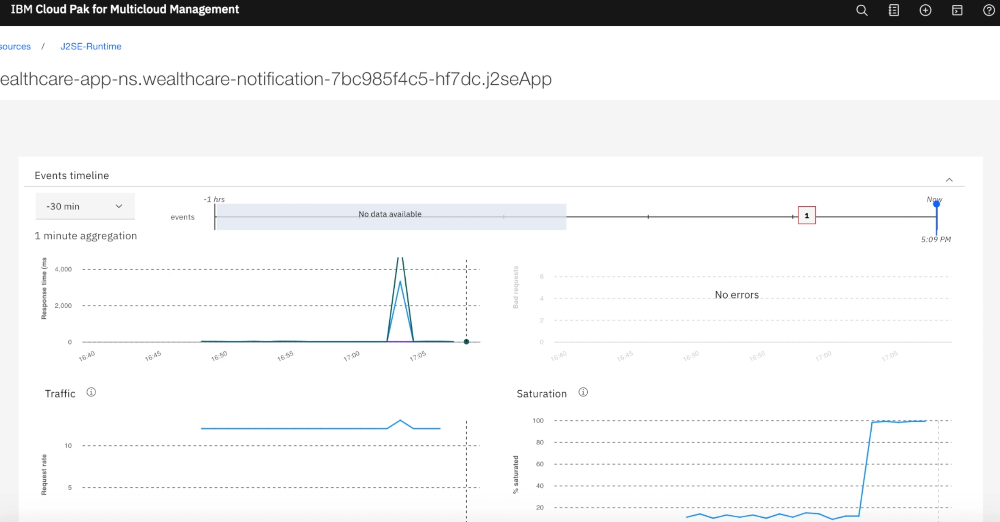

The Golden signal shows 

- Latency
- Error
- Traffic
- Saturation

The graph illustrate that the `saturation level is going up`.  

Now I need to see, how do I resolve this problem. 

Let me check is there any Runbook associated with this incident. 

------

## Resolve using Runbook

I go to the incident page again and look for the runbook.

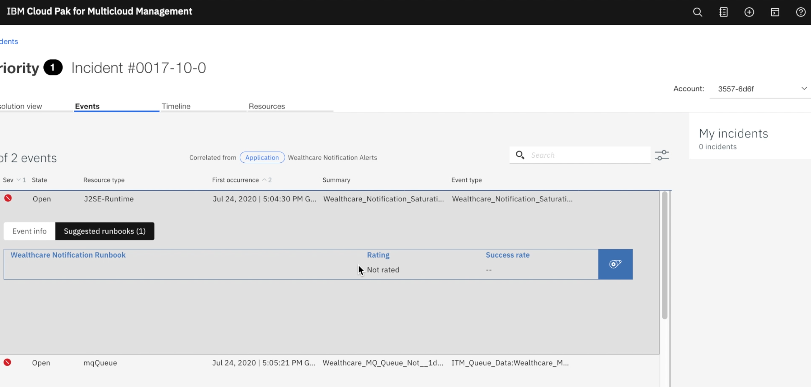

Runbook, contains the sequence of steps to solve the problem. Either it can be manual or automated. 

There is an run book assoicated this event. Let me choose the runbook.

I need to assign the incident to me. 

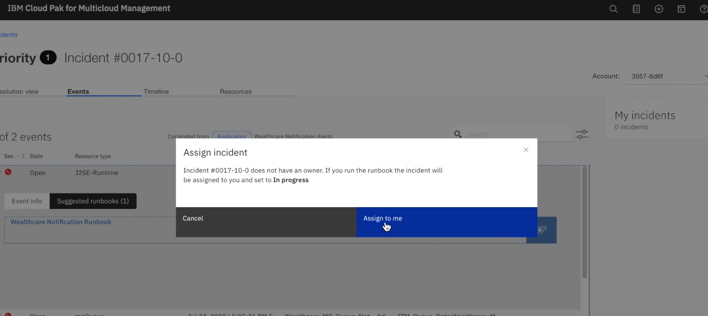

The first step in the runbook is not relevant to this issue.
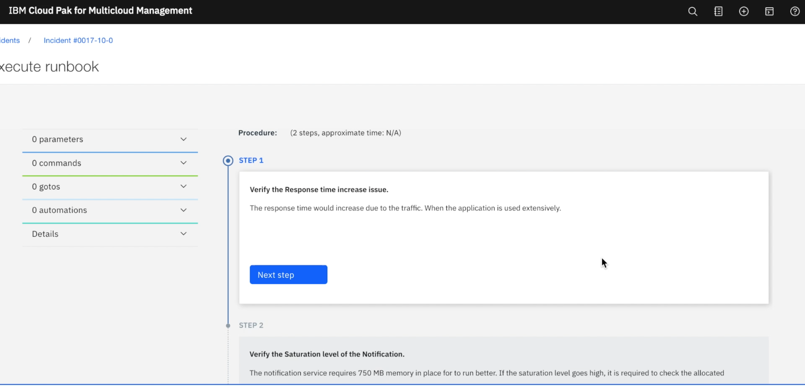

Let me go to the second step.
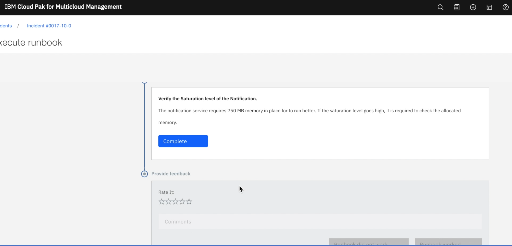

As per step2, the notification service requires 750 MB memory. But seeing through the definition of this kubernetes resource, got to know that less memory was requested. 

I will go and increase the memory request and limit in the kubernetes resource.

After the memory correction the Notification service was able to resume the service without any issues.

Then the notification service was able to read the messages from Message Queue. Both the events are cleared now.

Now I resolve this incident.

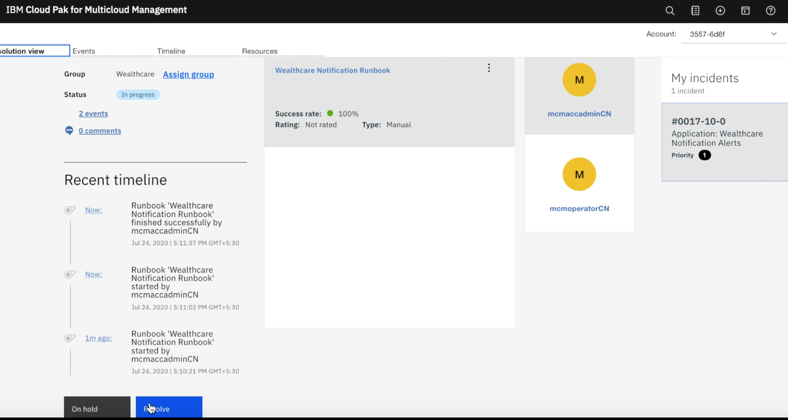

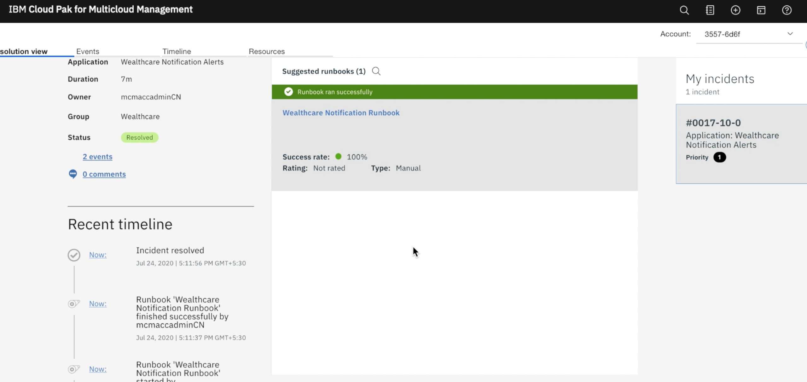

------